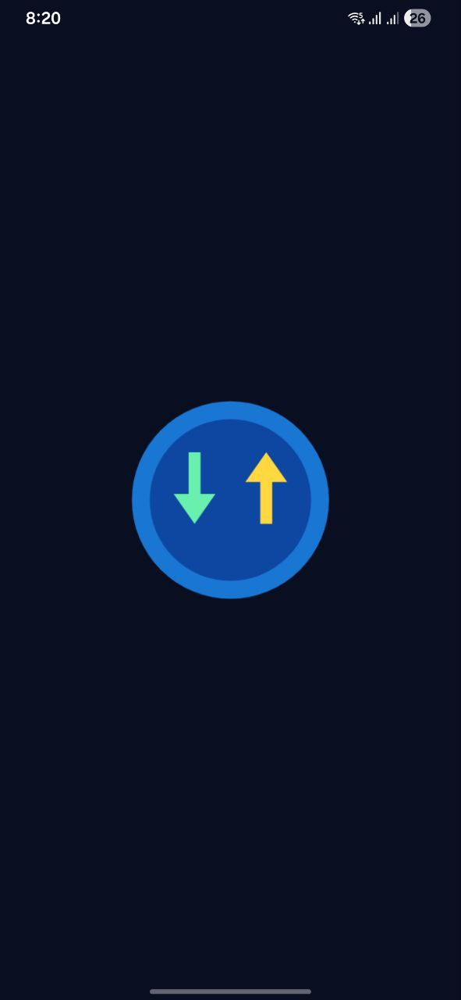
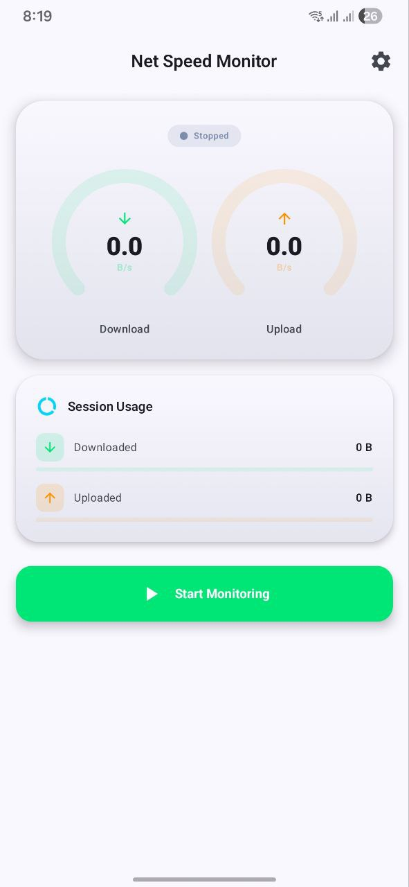
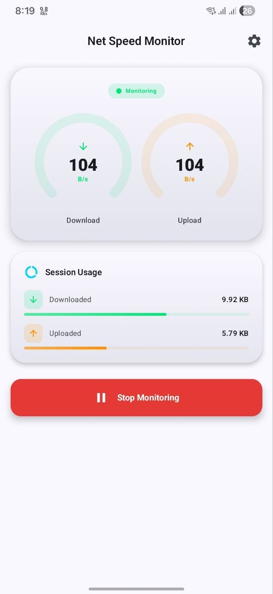
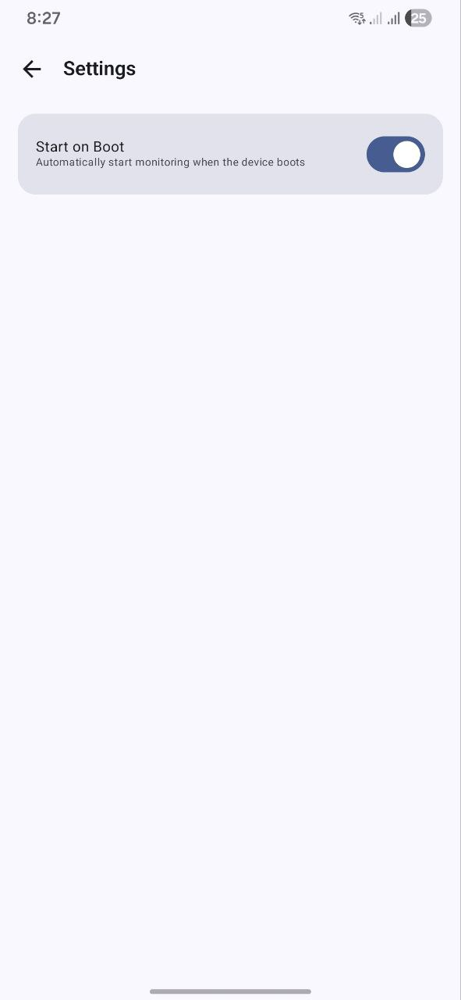
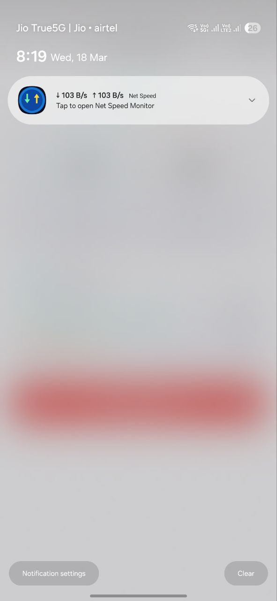

<div align="center">

# ⚡ Net Speed Monitor

**A blazing-fast, always-on Android internet speed monitor.**
See your real-time upload & download speed — right in your status bar, every second.


-green)

</div>

---

## 👋 What does this app do? (For Everyone)

Net Speed Monitor is a lightweight Android app that **continuously shows you how fast your internet is — right now**.

- 📥 **Download speed** — how fast data is coming into your phone
- 📤 **Upload speed** — how fast data is going out from your phone
- 🔔 **Status bar notification** — always visible, even when the app is closed
- 📊 **Session data usage** — how much data you've used since opening the app
- ⚙️ **Works in the background** — no need to keep the app open
- 🚀 **Start on boot** — monitoring begins the moment your phone turns on

The app is designed to be **minimal, fast, and battery-friendly**. It uses no ads, no tracking, and no internet permissions — it only reads your device's own network counters.

---

## ✨ Features at a Glance

| Feature | What it means |
|---|---|
| ⚡ Real-time speed | Updates every 1 second (configurable: 0.5s / 1s / 2s) |
| 🔔 Sticky notification | Speed shown in status bar even when app is closed |
| 🌙 Dark & Light mode | Follows your system theme automatically |
| 🎨 Material You | Adapts to your wallpaper color on Android 12+ |
| 🔋 Battery friendly | No active polling — reads kernel counters directly |
| 📶 All interfaces | Tracks Wi-Fi, mobile data, ethernet — all at once |
| 🔁 Start on boot | Auto-restarts monitoring after device reboot |
| 🛠️ Configurable | Toggle what shows in notification; set update speed |

---

## 📱 Screenshots

| Splash Screen | Home — Monitoring Off | Home — Monitoring On |
|:---:|:---:|:---:|
|  |  |  |

| Settings Screen | Status Bar Notification |
|:---:|:---:|
|  |  |

---

## 🔧 Requirements (For Developers)

| Requirement | Version |
|---|---|
| Android Studio | Hedgehog (2023.1.1) or newer |
| JDK | 17 or newer |
| Android NDK | r25c or newer (auto-installed by Android Studio) |
| CMake | 3.22.1 |
| Gradle | 8.5 (via wrapper) |
| Android Device / Emulator | API 26+ (Android 8.0+) |

---

## 🏗️ Project Architecture

This project follows **Clean Architecture** with a strict 3-layer separation:

```
Presentation  ──▶  Domain  ◀──  Data
    (UI)        (Business)    (Sources)
```

No layer skips — the UI never talks to the database or native code directly.

### Full File Tree

```
netspeed-monitor/
├── app/
│   ├── proguard-rules.pro               # Release build code shrinking rules
│   └── src/main/
│       │
│       ├── cpp/                         ── Native C++ engine (compiled to libnetspeed.so)
│       │   ├── CMakeLists.txt           #  NDK/CMake build configuration
│       │   ├── netspeed_calculator.h    #  C++ calculator interface declaration
│       │   ├── netspeed_calculator.cpp  #  Reads /proc/net/dev, computes byte deltas
│       │   └── netspeed_jni.cpp         #  JNI bridge: exposes C++ to Kotlin
│       │
│       ├── AndroidManifest.xml          ── App entry point, permissions, service registration
│       │
│       └── java/com/netspeed/monitor/
│           │
│           ├── NetSpeedApp.kt           ── Application class (@HiltAndroidApp)
│           ├── MainActivity.kt          ── Single-activity host + Compose NavHost
│           │
│           ├── data/                    ── DATA LAYER (implementation details)
│           │   ├── native_/
│           │   │   └── NativeSpeedBridge.kt        # Kotlin ↔ C++ JNI wrapper
│           │   └── repository/
│           │       ├── SpeedRepositoryImpl.kt      # Emits Flow<NetworkSpeed> via JNI
│           │       └── PreferencesRepositoryImpl.kt # DataStore settings persistence
│           │
│           ├── domain/                  ── DOMAIN LAYER (pure business logic, no Android)
│           │   ├── model/
│           │   │   ├── NetworkSpeed.kt             # Speed data model + format helpers
│           │   │   └── ServiceState.kt             # Running / Stopped sealed interface
│           │   ├── repository/
│           │   │   ├── SpeedRepository.kt          # Interface: speed data contract
│           │   │   └── PreferencesRepository.kt    # Interface: settings contract
│           │   └── usecase/
│           │       ├── ObserveNetworkSpeedUseCase.kt  # Stream live speed as Flow
│           │       └── GetCurrentSpeedUseCase.kt      # One-shot speed snapshot
│           │
│           ├── presentation/            ── PRESENTATION LAYER (Compose UI + ViewModels)
│           │   ├── theme/
│           │   │   ├── Color.kt         # Brand palette (electric blue, green, orange)
│           │   │   ├── Type.kt          # Typography scale
│           │   │   └── Theme.kt         # Material 3 + dynamic color + dark/light
│           │   ├── component/
│           │   │   ├── SpeedGaugeCard.kt     # Animated arc gauges (Canvas)
│           │   │   ├── DataUsageCard.kt      # Session rx/tx totals + progress bars
│           │   │   └── MonitorToggleButton.kt # Start/stop pill button
│           │   ├── screen/
│           │   │   ├── HomeScreen.kt    # Dashboard: gauges + usage + toggle
│           │   │   └── SettingsScreen.kt # Preferences: boot, notification, interval
│           │   └── viewmodel/
│           │       ├── HomeViewModel.kt    # UI state + service control
│           │       └── SettingsViewModel.kt # Settings read/write
│           │
│           ├── di/                      ── DEPENDENCY INJECTION (Hilt modules)
│           │   ├── RepositoryModule.kt  # Binds interfaces to implementations
│           │   └── NativeModule.kt      # Placeholder for future native bindings
│           │
│           ├── service/
│           │   └── SpeedMonitorService.kt  # Foreground service (sticky notification)
│           │
│           └── receiver/
│               └── BootReceiver.kt     # Restarts service after device reboot
│
├── gradle/wrapper/
│   └── gradle-wrapper.properties      # Gradle 8.5 distribution URL
├── build.gradle.kts                   # Root project plugin declarations
├── settings.gradle.kts                # Module inclusion + repo config
├── gradle.properties                  # JVM args, AndroidX flags, parallel builds
├── gradlew / gradlew.bat              # Gradle wrapper executables
├── DEBUG.md                           # Build, run & debug guide
└── README.md                          # This file
```

---

## 🔬 How It Works (Technical Deep Dive)

### Speed Calculation — Native C++ Engine

The speed calculation is done entirely in **C++17** for maximum performance and minimal battery usage.

1. `/proc/net/dev` is a virtual file exposed by the Linux kernel listing each network interface's byte counters.
2. Every `N` milliseconds, the C++ layer reads this file, sums bytes across all non-loopback interfaces (Wi-Fi, mobile data, eth0, etc.), and stores a `NetworkSnapshot{rxBytes, txBytes, timestampNs}`.
3. On the next tick, it subtracts the previous snapshot from the current one and divides by the elapsed time in seconds:
   ```
   downloadSpeed = Δrx_bytes / Δtime_seconds
   uploadSpeed   = Δtx_bytes / Δtime_seconds
   ```
4. Timestamps use `std::chrono::steady_clock` (monotonic — immune to system clock changes).
5. Negative deltas (counter resets) and sub-millisecond intervals are guarded against.

### JNI Bridge

`NativeSpeedBridge.kt` declares `external fun` Kotlin functions that map 1:1 to registered JNI functions in `netspeed_jni.cpp`:

| Kotlin | C++ JNI |
|---|---|
| `nativeCalculateSpeed()` → `DoubleArray[2]` | Returns `[downloadBps, uploadBps]` |
| `nativeGetTotalBytes()` → `LongArray[2]` | Returns `[totalRx, totalTx]` |
| `nativeReset()` | Clears stored snapshot state |

A `std::mutex` protects the global `NetSpeedCalculator` singleton from concurrent thread access.

### Foreground Service Lifecycle

```
User taps Start
       │
       ▼
HomeViewModel.toggleMonitoring()
       │
       ├─▶ PreferencesRepository.setServiceEnabled(true)
       │
       └─▶ context.startForegroundService(ACTION_START)
                    │
                    ▼
           SpeedMonitorService.onStartCommand()
                    │
                    ├─▶ ServiceCompat.startForeground()  ← sticky notification appears
                    │
                    └─▶ coroutineScope.launch {
                              ObserveNetworkSpeedUseCase()  ← infinite Flow
                                       │
                                       └─▶ notificationManager.notify()  ← updates every tick
                        }
```

### Data Flow

```
/proc/net/dev  (Linux kernel)
       │
       ▼
 NetSpeedCalculator.cpp  (C++, delta computation)
       │  JNI
       ▼
 NativeSpeedBridge.kt  (Kotlin external fun)
       │
       ▼
 SpeedRepositoryImpl  (emits Flow<NetworkSpeed>)
       │
       ▼
 ObserveNetworkSpeedUseCase  (domain layer)
       │
       ├──▶  HomeViewModel  ──▶  HomeScreen (Compose UI)
       │
       └──▶  SpeedMonitorService  ──▶  Notification
```

---

## 🛠️ Tech Stack

| Layer | Technology | Version |
|---|---|---|
| Language | Kotlin | 1.9.22 |
| Native | C++17 via Android NDK | r25c+ |
| UI | Jetpack Compose | BOM 2024.02.00 |
| Design | Material 3 + Dynamic Color | Latest |
| Architecture | Clean Architecture + MVVM | — |
| DI | Hilt | 2.51 |
| Async | Kotlin Coroutines + Flow | 1.8.0 |
| Storage | Jetpack DataStore Preferences | 1.0.0 |
| Build | Gradle + CMake | 8.5 + 3.22.1 |
| Min SDK | Android 8.0 | API 26 |
| Target SDK | Android 14 | API 34 |

---

## 🔐 Permissions Explained

| Permission | Why it's needed |
|---|---|
| `ACCESS_NETWORK_STATE` | Reads which network interfaces are active |
| `FOREGROUND_SERVICE` | Required to run a persistent background service |
| `FOREGROUND_SERVICE_DATA_SYNC` | Required on Android 14+ to declare service type |
| `RECEIVE_BOOT_COMPLETED` | Lets the app restart monitoring after a reboot |
| `POST_NOTIFICATIONS` | Required on Android 13+ to show the speed notification |

> **Privacy note:** This app reads only your device's own network byte counters from the Linux kernel. It does **not** access the internet, capture packet content, or collect any personal data.

---

## 🚀 Quick Build & Run

See **[DEBUG.md](DEBUG.md)** for the full guide covering prerequisites, ADB setup, logcat filtering, signing, and troubleshooting.

### Debug Build

```bash
# Make wrapper executable (first time only)
chmod +x gradlew

# Build + install debug APK directly to connected device
./gradlew installDebug

# Or: build APK without installing
./gradlew assembleDebug
# Output: app/build/outputs/apk/debug/app-debug.apk

# Launch app after install
adb shell am start -n com.netspeed.monitor.debug/.MainActivity
```

### Production Release Build

```bash
# Build unsigned release APK
./gradlew assembleRelease
# Output: app/build/outputs/apk/release/app-release.apk

# Build AAB for Google Play Store
./gradlew bundleRelease
# Output: app/build/outputs/bundle/release/app-release.aab

# Build with signing credentials (set env vars first)
export KEYSTORE_PASS="your_keystore_password"
export KEY_PASS="your_key_password"
./gradlew assembleRelease

# Install release APK to device
adb install -r app/build/outputs/apk/release/app-release.apk
adb shell am start -n com.netspeed.monitor/.MainActivity
```

### Clean Build

```bash
# Wipe all build outputs and rebuild from scratch
./gradlew clean assembleDebug

# Skip lint and tests for faster builds
./gradlew assembleRelease -x lint -x test
```

---

## 🤝 Contributing

1. Fork the repository
2. Create a feature branch: `git checkout -b feature/my-feature`
3. Follow the existing architecture — new features belong in the correct layer
4. Test on a physical device (emulators may not report real `/proc/net/dev` traffic)
5. Submit a pull request with a clear description

---

## 📄 License

This project is licensed under the **MIT License** — see [LICENSE](LICENSE) for details.

---

<div align="center">
Made with ❤️ using Kotlin + C++ · Android · JNI · Jetpack Compose
</div>
